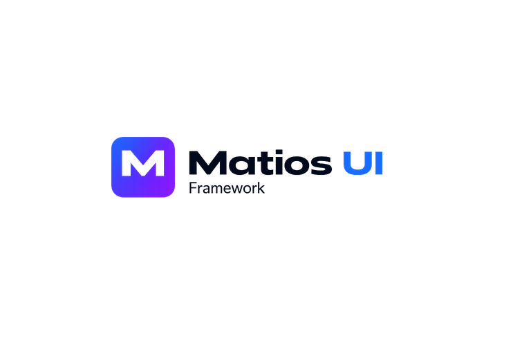

<p align="center">
  
</p>

<h1 align="center">Matios UI Framework</h1>

<p align="center">
  Framework de UI sin dependencias, hecho con CSS y JavaScript puros.<br>
  Theming por modo + acento &nbsp;·&nbsp; Soporte de alto contraste &nbsp;·&nbsp; 85+ componentes &nbsp;·&nbsp; 316 íconos
</p>

<p align="center">
  
  
  
  &nbsp;·&nbsp; <a href="./README.md">English</a>
</p>

---

> **Nota de idioma.** La documentación completa del framework (el `README.md` en inglés y los `.md` de cada componente)
> está en **inglés**, el estándar de la comunidad open source. Esta página es la **puerta de entrada en español** y espeja
> el contenido del README en inglés. La interfaz de los componentes sí es multi-idioma en runtime (es/en/pt).

---

## Por qué Matios UI

La mayoría de las librerías de UI están atadas a un framework, sobrecargadas de dependencias, o son difíciles de
adaptar a proyectos reales. Matios UI toma otro camino:

| | |
|---|---|
| **Cero dependencias** | CSS puro + JavaScript plano — sin paso de build |
| **Agnóstico de framework** | Funciona en sitios estáticos, apps server-rendered, sistemas legacy y microfrontends |
| **Componentes autónomos** | Cada componente trae su propio `.css`, `.js`, doc `.md` y `demo.html` |
| **Theming real** | Modelo modo + acento con soporte completo de alto contraste |
| **Fácil de inspeccionar** | Código abierto y legible — sin bundles minificados para revertir |

---

## Inicio rápido

Abre `index.html` en tu navegador para explorar la librería completa de componentes.

```
matios-ui-framework/
├── index.html
├── base/
├── forms/
├── navigation/
├── overlays/
├── display/
├── layout/
├── data/
├── icons/
├── utilities/
├── widgets/
├── themes/
├── support/
└── apps-showcase/
```

### Uso mínimo

```html
<!-- Base + tema -->
<link rel="stylesheet" href="base/matios-ui-base.css">
<link rel="stylesheet" href="themes/matios-ui-mode-dark.css">
<link rel="stylesheet" href="themes/matios-ui-accent-violet.css">

<!-- Componente -->
<link rel="stylesheet" href="forms/matios-ui-input/matios-ui-input.css">
<script src="forms/matios-ui-input/matios-ui-input.js"></script>

<div id="mi-input"></div>

<script>
  new MTS.Input('#mi-input', {
    label: 'Nombre',
    placeholder: 'Ingresa tu nombre'
  });
</script>
```

---

## Levantar localmente

El framework **no tiene paso de build**, pero el explorador y los demos cargan archivos por HTTP (docs de componentes, demos, datos mock) — así que conviene servir la carpeta en lugar de abrir los archivos directamente con `file://`.

**VS Code + Live Server (recomendado)**

1. Instala la extensión **Live Server** de *Ritwick Dey* — [marketplace](https://marketplace.visualstudio.com/items?itemName=ritwickdey.LiveServer).
2. Click derecho en `index.html` → **Open with Live Server**.
3. El navegador abre en `http://127.0.0.1:5500` con recarga en vivo al guardar.

**O cualquier servidor estático**

```bash
npx serve .
# o
python -m http.server 5500
```

---

## Theming

Matios UI usa un modelo **modo + acento** controlado por atributos HTML.

### Modos

```html
<html data-mts-mode="light">
<html data-mts-mode="dark">
<html data-mts-mode="high-contrast">
```

### Acentos

```html
<html data-mts-mode="dark" data-mts-accent="violet">
<html data-mts-mode="light" data-mts-accent="blue">
```

Acentos disponibles: `violet` · `olive` · `blue` · `corporate` · `navy` · `emerald` · `petrol`

> `high-contrast` es un modo independiente — no requiere acento.

---

## Grupos de componentes

### Forms
`Button` · `Input` · `Select` · `Checkbox` · `Radio` · `Toggle` · `Slider` · `TagInput` · `Rating` · `DatePicker` · `FileUpload` · `NumberInput` · `PhoneInput` · `NationalId` · `ColorPicker` · `RichEditor` · `FormLayout` · `FormGuard` · `CopyButton` · `ConfirmButton` · `Label` · `PasswordStrength` · `TransferList` · `Validate`

### Navigation
`Tabs` · `Accordion` · `Breadcrumb` · `Stepper` · `StepProgress` · `Drawer` · `Dropdown` · `PanelDropdown` · `Pagination` · `CommandPalette` · `ContextMenu` · `SideNav` · `TabBar` · `Topbar` · `Menu`

### Overlays
`Alert` · `Badge` · `Tooltip` · `Modal` · `Popover` · `Toast` · `Progress` · `Skeleton` · `Spinner` · `Lightbox`

### Display
`Avatar` · `Card` · `KPICard` · `EmptyState` · `Timeline` · `SortableList` · `Countdown` · `RatingReview` · `Tree` · `ImageGallery` · `VirtualList` · `MarkdownViewer`

### Layout
`Grid` · `Scroll` · `Splitter` · `ScrollSpy` · `IntersectionReveal`

### Data
`Table` · `DataTable` (widget)

### Utilities
`HttpClient` · `CodeBlock` · `DevPanel` · `DiagnosticsPanel` · `JsonViewer` · `SessionTimeout` · `PageLoader` · `Sanitize` · `Browser`

### Icons
**316 íconos** — outline / filled · variantes de color semántico · variantes de tamaño · animación spin

```html
<i class="mts-icon mts-icon-trash"></i>
<i class="mts-icon mts-icon-trash mts-icon--filled mts-icon--danger"></i>
<i class="mts-icon mts-icon-loader mts-icon--spin"></i>
```

---

## Widgets

Componentes de mayor nivel compuestos a partir de primitivas.

| Widget | Descripción |
|---|---|
| **DataTable** | Grilla de datos completa — orden, filtros, paginación, plugins (DocumentManager, Toolbar, ColumnVisibility, ExpandRow, Filter) |
| **Calendar** | Vistas mes / semana / día / agenda con gestión de eventos, drag & drop y datasource async |
| **Boards** | `GanttChart` (Gantt SVG + WBS, baseline, undo/redo) · `Kanban` · `SprintBoard` — cada uno con su doc de contrato FE↔BE |
| **Dashboard** | Template de admin — _en desarrollo_ |

---

## Estructura de un componente

Todo componente sigue el mismo patrón:

```
matios-ui-xxx/
├── matios-ui-xxx.css
├── matios-ui-xxx.js
├── matios-ui-xxx.md
└── demo.html
```

---

## Apps Showcase

`apps-showcase/` contiene pantallas de UI completas y realistas, construidas exclusivamente con componentes de Matios UI.

**Grupos disponibles:**
- **Authentication** — login, forgot-password, reset-password, verify-email, workspace-selector, session-expired, access-denied, accept-invitation
- **Onboarding** — signup-basic, signup-with-company, invite-team, onboarding-complete
- **Account** — profile-overview, security-settings
- **Settings** — workspace-settings, security-policies
- **Support** — ticket-inbox, ticket-detail, ticket-resolution
- **Productivity** — task-board, calendar-planner, task-detail
- **Notifications** — notification-center, activity-feed
- **Admin** — members-list, member-detail, invite-member, access-review, role-detail
- **Billing** — current-plan, invoice-history, payment-methods, usage-and-limits, plan-change-preview
- **Developers** — api-keys, webhooks
- **Integrations** — integrations-hub, integration-detail, connect-provider, sync-history
- **Documents** — recent-files, file-preview, share-dialog
- **Search** — global-search, search-results
- **System** — error-404, error-403, error-500, maintenance-mode, empty-workspace

---

## Puntos de entrada

| Archivo | Propósito |
|---|---|
| `index.html` | Explorador principal del framework |
| `themes/demo.html` | Preview de theming modo + acento |
| `icons/demo.html` | Catálogo completo de íconos |
| `apps-showcase/index.html` | Catálogo de pantallas del showcase |
| `<grupo>/demo.html` | Navegación de componentes por grupo |
| `<componente>/demo.html` | Demo aislado del componente |

---

## Eventos

Los componentes emiten eventos usando el namespace `mts:*`:

```javascript
document.getElementById('mi-calendario')
  .addEventListener('mts:calendar:eventDrop', function(e) {
    console.log(e.detail);
  });
```

---

## Principios de diseño

- Usar componentes Matios primero — evitar UI ad-hoc cuando ya existe un componente real
- Cada componente es autónomo e independiente
- Los demos son consistentes, realistas e inspeccionables
- El código es legible — sin pipeline de build
- Nombres, agrupación y estructura siguen las mismas convenciones en todo el proyecto

Ver [`CONTRIBUTING.md`](./CONTRIBUTING.md) para las convenciones de código, reglas y flujo de desarrollo completos.

---

## Estado

Matios UI está **listo para producción** como framework — estructura coherente, theming consistente, cobertura completa
de componentes y documentación real por componente.

---

## Documentación

- Cada componente tiene su propio `.md` (Installation · Usage · Options · API · Events · CSS Variables · Accessibility ·
  Changelog) junto a su `.css`/`.js`/`demo.html`.
- Cada grupo de componentes tiene un `README.md` índice que lista sus componentes.
- Los docs detallados están en inglés; el `README.md` raíz es el punto de entrada principal.

## Contribuir

Ver [`CONTRIBUTING.md`](./CONTRIBUTING.md) y el [`CODE_OF_CONDUCT.md`](./CODE_OF_CONDUCT.md). Issues y pull requests son bienvenidos.

## Licencia

[MIT](./LICENSE) © Matios SpA.

## 💛 Apoyar el proyecto

Matios UI es gratuito y con licencia MIT. Si te ahorra tiempo, puedes apoyar su desarrollo:

[](https://ko-fi.com/gcontrerasgomez)

<details>
<summary><strong>🪙 Donar con cripto</strong></summary>

<br>

| Red | Dirección |
|---|---|
| **Ethereum / EVM** (ETH, USDC, …) | `0x5ea6F302Fb8a9865540FfCC42F7264c996532dC3` |
| **Bitcoin** (SegWit nativo) | `bc1qv43are3facy6lyuzp5qpdqpt8x7tcz2cx3aspe` |
| **Solana** (SOL, SPL) | `BYtfMGEoxBLf5DMPoLyebUJpEh1hW9jGEvjiaEiuRmjw` |
| **TRON** (USDT-TRC20) | `TFHuJKpPNZcdEPsfCknDpvY6CzQbpWYGUv` |

</details>

Cada aporte ayuda a mantener el proyecto. ¡Gracias! 🙏

---

<p align="center">
  <strong>Matios UI Framework</strong><br>
  CSS puro &nbsp;·&nbsp; JavaScript puro &nbsp;·&nbsp; Estructura real.
</p>
