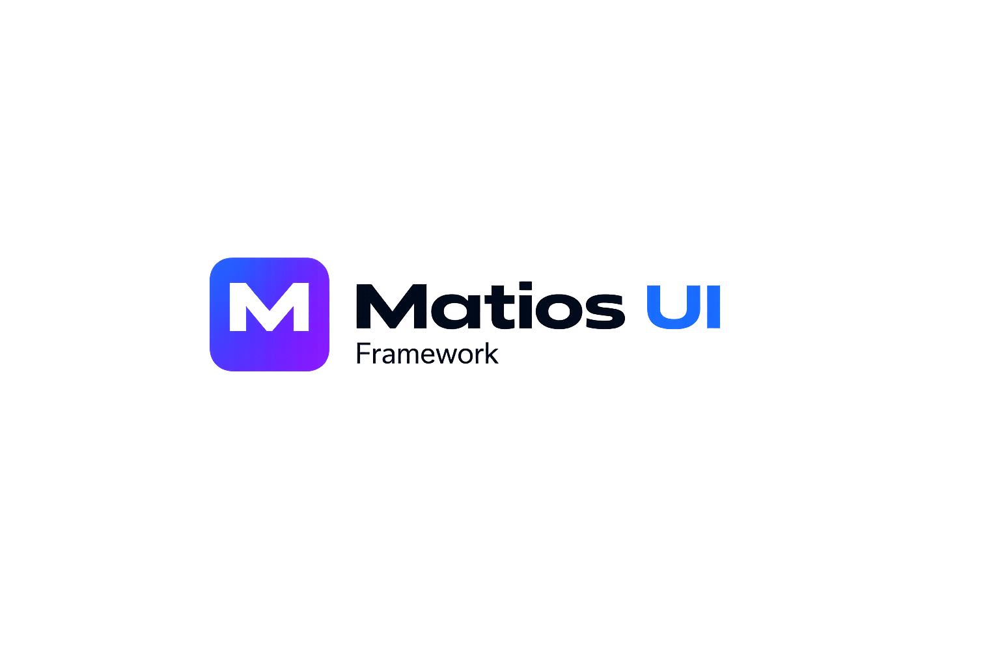

<p align="center">
  
</p>

<h1 align="center">Matios UI Framework</h1>

<p align="center">
  Zero-dependency UI framework built with plain CSS and JavaScript.
  <br>
  Mode + accent theming, high-contrast support, live demos, and real component structure.
</p>

---

## Overview

**Matios UI Framework** is a framework-agnostic UI system for modern web applications built with **pure CSS and JavaScript**.

It is designed to be:

- **Zero dependency**
- **Easy to inspect**
- **Easy to extend**
- **Reusable in static sites, server-rendered apps, legacy systems, and custom platforms**
- **Consistent across components, demos, and documentation**

Matios UI includes:

- **60+ components**
- **278 SVG icons**
- **Mode + accent theming**
- **High-contrast mode**
- **Standalone demos per component**
- **Component-level Markdown documentation**
- **Shared utilities and showcase pages**
- **Calendar and calendar integrations**

---

## Why Matios UI

Most UI libraries are tied to a framework, overloaded with dependencies, or difficult to adapt to real projects.

Matios UI takes a different approach:

- **No external runtime dependencies**
- **Pure CSS + JS**
- **Consistent design language**
- **Simple and inspectable folder structure**
- **Each component ships with its own CSS, JS, docs, and demo**
- **Works well in enterprise, internal tools, and custom frontends**

---

## Features

- **Zero dependencies**
- **Framework-agnostic**
- **Pure CSS and JavaScript**
- **Mode-based theming**
  - `dark`
  - `light`
  - `high-contrast`
- **Accent layer**
  - `violet`
  - `olive`
  - `blue`
- **Reusable demo shell**
- **High-contrast support**
- **Component grouping by domain**
- **Realistic showcase pages**
- **HTTP client helper**
- **Icon system**
- **Open and easy-to-read structure**

---

## Quick Start

Open `index.html` in your browser to explore the framework.

```text
matios-ui-framework/
├─ index.html
├─ Matios-UI-logo.png
├─ base/
├─ forms/
├─ navigation/
├─ overlays/
├─ display/
├─ layout/
├─ data/
├─ icons/
├─ shared/
├─ themes/
├─ calendar/
├─ /
└─ apps-showcase/
```

### Minimal Usage

```html
<link rel="stylesheet" href="base/matios-ui-base.css">

<link rel="stylesheet" href="themes/matios-ui-mode-dark.css">
<link rel="stylesheet" href="themes/matios-ui-accent-violet.css">

<link rel="stylesheet" href="forms/matios-ui-input/matios-ui-input.css">
<script src="forms/matios-ui-input/matios-ui-input.js"></script>

<div id="nameInput"></div>

<script>
  new MTS.Input('#nameInput', {
    label: 'Name',
    placeholder: 'Enter your name'
  });
</script>
```

---

## Theming

Matios UI uses a **mode + accent** model.

### Modes

```html
<html data-mts-mode="dark">
<html data-mts-mode="light">
<html data-mts-mode="high-contrast">
```

### Accents

```html
<html data-mts-mode="dark" data-mts-accent="violet">
<html data-mts-mode="light" data-mts-accent="olive">
<html data-mts-mode="dark" data-mts-accent="blue">
```

### High Contrast

`high-contrast` is a complete mode by itself.

```html
<html data-mts-mode="high-contrast">
```

It does **not require an accent** to work correctly.

### Theme CSS Files

```html
<link rel="stylesheet" href="themes/matios-ui-mode-dark.css">
<link rel="stylesheet" href="themes/matios-ui-mode-light.css">
<link rel="stylesheet" href="themes/matios-ui-mode-high-contrast.css">

<link rel="stylesheet" href="themes/matios-ui-accent-violet.css">
<link rel="stylesheet" href="themes/matios-ui-accent-olive.css">
<link rel="stylesheet" href="themes/matios-ui-accent-blue.css">
```

---

## Project Structure

Every component follows the same structure:

```text
matios-ui-xxx/
├─ matios-ui-xxx.css
├─ matios-ui-xxx.js
├─ matios-ui-xxx.md
└─ demo.html
```

This makes the framework:

- easy to learn
- easy to debug
- easy to maintain
- easy to extend

---

## Component Groups

### Forms
- Button
- Input
- Select
- Checkbox
- Radio
- Toggle
- Slider
- TagInput
- Rating
- Date Picker
- File Upload
- Validation
- Number Input
- Phone Input
- Color Picker
- Rich Text Editor
- FormLayout
- Copy Button
- Confirm Button
- Label

### Navigation
- Tabs
- Accordion
- Breadcrumb
- Stepper
- Drawer
- Dropdown
- Pagination
- Command Palette
- Context Menu
- SideNav
- TabBar
- ScrollSpy
- Intersection Reveal

### Overlays
- Alert
- Badge
- Tooltip
- Modal
- Popover
- Toast
- Progress
- Skeleton
- Spinner
- Lightbox

### Display
- Avatar
- Card
- KPI Card
- Empty State
- Timeline
- Kanban
- Sortable List
- Countdown
- Rating Review
- Tree
- Image Gallery
- Virtual List
- Splitter

### Layout
- Grid
- ScrollSpy
- Intersection Reveal
- Splitter

### Data
- Table
- Infinite utilities
- data-oriented demos and helpers

### Shared
- HttpClient
- shared demo support

### Icons
- **278 icons**
- outline / filled
- semantic colors
- size variants
- animation support

Example:

```html
<i class="mts-icon mts-icon-trash"></i>
<i class="mts-icon mts-icon-trash mts-icon--filled mts-icon--danger"></i>
<i class="mts-icon mts-icon-loader mts-icon--spin"></i>
```

### Themes
- mode switching
- accent switching
- high-contrast preview
- CSS variable inspection

### Calendars
- calendar demos
- calendar
- schedule-oriented UI examples

### Showcase
- higher-level demo pages
- more realistic app-like screens
- shell validation for components in context

---

## Documentation Strategy

Matios UI is not just a list of components.

Each component includes:

- a **standalone demo**
- a **Markdown documentation file**
- real **HTML / JavaScript examples**
- a **consistent preview structure**

That makes the repo useful both as a framework and as a living reference library.

---

## Design Principles

Matios UI is being shaped around these principles:

- **Use Matios components first**
- **Avoid fake demo-only UI when a real component already exists**
- **Keep demos visually consistent**
- **Keep helpers minimal**
- **Respect naming and grouping**
- **Prefer clarity over cleverness**
- **Keep the source easy to inspect**

---

## Accessibility Direction

Matios UI includes a dedicated **high-contrast mode** and continues moving toward stronger accessibility consistency through:

- visible focus states
- stronger contrast handling
- semantic colors
- clearer interaction states
- reusable theme variables

---

## Events and Integration

Components can emit events using the `mts:*` namespace pattern.

```javascript
document.getElementById('my-calendar')
  .addEventListener('mts:calendar:eventDrop', function (e) {
    console.log(e.detail);
  });
```

Because Matios UI is framework-agnostic, it can be used in:

- static HTML projects
- server-rendered apps
- legacy enterprise apps
- custom JavaScript apps
- microfrontend environments

---

## Current Status

Matios UI is already in a strong state:

- coherent framework structure
- more consistent demos
- consolidated mode/accent theming
- integrated high-contrast mode
- restored calendar compatibility in the v2 architecture
- strong open-source baseline

This is no longer just a prototype.  
It is a real framework with its own technical and visual identity.

---

## Recommended Entry Points

- `index.html` → main framework shell
- `themes/demo.html` → theming preview
- `icons/demo.html` → icon system
- group `demo.html` files → grouped navigation
- per-component `demo.html` files → isolated examples

---

## License / Usage

Use it, inspect it, adapt it, and build on top of it.

Matios UI Framework is being built to be practical, understandable, and genuinely reusable.

---

<p align="center">
  <strong>Matios UI Framework</strong><br>
  Pure CSS. Pure JavaScript. Real structure.
</p>
